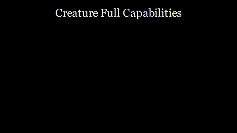
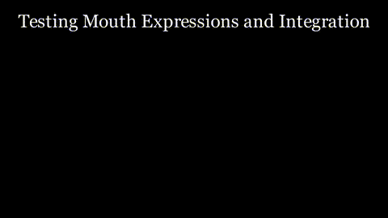

# PsiCreature Manim Library

This repository contains Manim code for creating animated "Psi Creature".

---

**Copyright (c) 2025 Amirhossein Rezaei (rezaeeamirhosein@gmail.com). All Rights Reserved.**

**For detailed terms of use and distribution, please refer to the [LICENSE](LICENSE) file.**

## 🎬 Automated Video Previews

Here are the latest test videos, automatically converted to GIFs.

<!-- START_GIFS -->
### TestCreatureFullCapabilities

### TestMouthExpressions

<!-- END_GIFS -->
